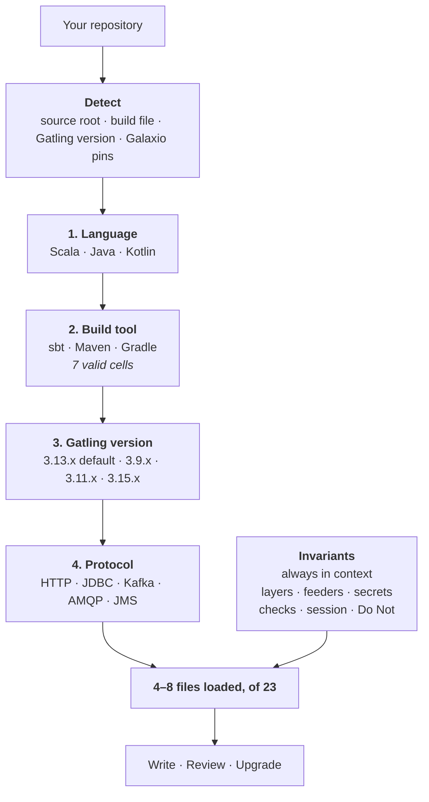

# Galaxio Gatling Pro

An agent skill for writing, reviewing and upgrading Gatling JVM performance tests in Galaxio
style. Works unchanged in **Cursor**, **Claude Code** and **Codex**.

Previously the standalone repository `galax-io/galaxio-gatling-pro`. That repository is
deprecated and archived; this plugin is the maintained home.

## What you get

Ask in plain language, get a Gatling test that compiles and runs **in your project** — your
language, your build tool, your Gatling version. Not a template you then have to adapt.

Run the agent from the directory holding your build file. The skill reads the project and
adapts to it; an empty directory gets a working project from nothing.

## Why you would want it

Ask any coding agent for a Gatling test and it will write one, and it will usually compile.
It will also be wrong in the ways that matter here, because the failures in load testing are
silent:

- A rate handed to a builder that wanted a population, so a "50 req/s" test injects 50
  concurrent users — or, below 1, injects nobody and finishes green with no requests at all.
- A `maxDuration` sized from arithmetic one ramp short, so the top stage never executes and
  the report still looks complete.
- A `simulation.conf` that keeps its `localhost` default when the environment variable is
  missing, so the whole run measures the loopback interface.
- A feeder that exhausts mid-run, or one generating identifiers the system under test has
  never seen — a full-speed measurement of the 404 path.
- Picatinny imports from the wrong major, because that library's API breaks on its own
  version, not on the Gatling version everyone checks first.

None of these throw. They produce a chart. This skill encodes the distinctions that separate
a load test from a load-shaped script.

## Install

### Claude Code

```bash
claude plugin marketplace add galax-io/ai-plugins
```

Then, in the session:

```text
/plugin install galaxio-gatling-pro@galaxio-performance-kit
```

### Codex

```bash
codex plugin marketplace add galax-io/ai-plugins
```

Then `/plugins` to enable it. Invoke the skill with `$galaxio-gatling-pro`.

### Cursor

Cursor has no CLI for third-party marketplaces. Two supported paths:

- **Team marketplace** — Dashboard → **Plugins** → **Add Marketplace** → **Import from
  Repo**, pointed at `galax-io/ai-plugins`. Members install from the marketplace UI.
- **Local** — copy `plugins/galaxio-gatling-pro` into `~/.cursor/plugins/local/`, keeping
  `.cursor-plugin/plugin.json` at the plugin root, then **Developer: Reload Window**.

## How it works



Each step discards the references that cannot apply. Language goes first because it is the
widest filter — sbt serves Scala only, so a Kotlin project has already lost a third of the
build matrix before the version is read.

The split is there for correctness, not to save tokens: each build file describes one language
and they contradict each other on purpose, so an agent that reads two produces advice matching no
real project.

## First run

Open the agent in your repository root and ask, for example:

```text
Set up a minimal Gatling project with one scenario against the home page
```

What happens:

1. The skill reads your build file, source directories and dependencies. It asks nothing
   when the answer is unambiguous.
2. It creates the `cases / feeders / scenarios / simulations` tree plus `simulation.conf`
   and `logback.xml`, in the directories your build tool expects.
3. It gives you the run command — different for sbt, Maven and Gradle.
4. It tells you which environment variables to export first. A key that must come from the
   environment is written with no default, so a run without it stops immediately and names
   the key rather than quietly targeting localhost.

Nothing to detect — an empty directory — falls back to Gatling 3.13.x, Scala 2.13, Java 17
and sbt.

## What you can ask it

### Add a scenario to an existing project

```text
Add a scenario: log in, then three catalog requests, data from accounts.csv
```

Layout, naming and style come from what is already in the repository. **An existing project
outranks the skill** — its own opinions apply only where there is nothing to follow.

Identifiers the system under test must already know are asked for as a CSV; everything else
is generated. Backwards, you get a run that faithfully measures how fast your service
returns 404.

### Review what is already written

```text
Review this simulation
```

Covers layer boundaries, feeder choice, config and secrets, checks, session handling, the
injection model and `maxDuration`. It applies the rules for **your** Gatling line — they differ
from one line to the next, and a review that skips detection compares your code against the
wrong ones.

### Work out why a green run sent no load

```text
The test passes but there are almost no requests in the report
```

It knows the specific causes: an arrival rate fed to a closed profile, a `maxDuration`
shorter than the profile, an unset environment variable leaving a default in place, an
exhausted feeder.

### Add a database, Kafka or a queue

```text
Add a JDBC scenario against the orders table
```

For JDBC it will raise the pool separately: `maximumPoolSize` below the number of virtual
users reaching the database means the test measures the pool, not the database — and a pool
larger than the server's `max_connections` takes down every other client of a shared
environment.

Asked to add Kafka on an older Gatling, it will usually answer with a **pin, not an
upgrade** — the Galaxio libraries publish for older lines too.

### Move up a Gatling line

```text
Migrate this project from 3.11 to 3.13
```

You get an ordered checklist, including what breaks on the intermediate 3.12 that nothing
stops on. The skill will not raise the version by itself; it proposes and waits.

## Supported versions

### Gatling

| Line     | What you get                                                                        |
| -------- | ----------------------------------------------------------------------------------- |
| `3.15.x` | Covered as a plain Gatling target, with Picatinny substituted rather than guessed   |
| `3.14.x` | Covered, sharing the 3.15.x column; the Jakarta move is what separates it from 3.13 |
| `3.13.x` | **Default.** The newest line every Galaxio library publishes for                    |
| `3.12.x` | Not profiled. The skill says so and reads the artifact's POM — it never guesses     |
| `3.11.x` | Fully covered as legacy — and not a reason to upgrade on its own                    |
| `3.10.x` | Not profiled. The skill says so and reads the artifact's POM — it never guesses     |
| `3.9.x`  | Fully covered, including the pre-3.11 API that still compiles there                 |

### Language and build tool

|            | sbt | Maven | Gradle |
| ---------- | --- | ----- | ------ |
| **Scala**  | ✅  | ✅    | ✅     |
| **Java**   | —   | ✅    | ✅     |
| **Kotlin** | —   | ✅    | ✅     |

Seven cells, seven build references, so no file mixes languages. Baseline for all of them:
Scala `2.13.x` — any patch, since 2.13 is binary-compatible across them and Galaxio publishes
`_2.13` artifacts only. The Java floor comes from the line: 17+ wherever the Picatinny `1.x`
facade is used, and Java 8 on the 3.9.x profile.

### Protocols

| Protocol | Comes from                      | Available on                         |
| -------- | ------------------------------- | ------------------------------------ |
| HTTP     | Gatling core                    | every line                           |
| JDBC     | `gatling-jdbc-plugin`, Galaxio  | 3.9.x, 3.11.x, 3.13.x                |
| Kafka    | `gatling-kafka-plugin`, Galaxio | 3.9.x, 3.11.x, 3.13.x                |
| AMQP     | `gatling-amqp-plugin`, Galaxio  | 3.9.x, 3.11.x, 3.13.x                |
| JMS      | Gatling core                    | every line; `javax.jms` up to 3.13.x |

The move from `javax.jms` to `jakarta.jms` lands at 3.14, which is why a 3.14+ project needs a
broker client that speaks the Jakarta API.

All five work from all three languages: the Galaxio libraries ship first-party facades under
`org.galaxio.gatling…javaapi`, so the `_2.13` suffix names the artifact, not the caller.

### Galaxio libraries

Each publishes for **more than one** Gatling line, so a Galaxio dependency never tells you which
line a project is on — every one of them declares `gatling-core` at `provided` scope, which means
your own Gatling pin decides and the library version is checked against it.

Each library crosses onto a new line at its own release, and the four do not cross together. The
skill knows where every crossing is and checks a pin against the detected line before touching it;
the numbers live in one place,
[references/versions.md](skills/galaxio-gatling-pro/references/versions.md), rather than being
restated here where they could quietly disagree.

### Picatinny API

Picatinny breaks on its own version rather than on the Gatling line, which is why the skill
splits it that way. There are two boundaries and they are not in the same place:

| Picatinny           | Config getters | Faker API | `Random*Feeder` | Gatling        |
| ------------------- | -------------- | --------- | --------------- | -------------- |
| `0.14.0` – `1.0.1`  | 5              | —         | current         | 3.9.x – 3.11.x |
| `1.2.0` – below 1.5 | 14             | —         | current         | 3.11.x         |
| `1.5.0` – `1.10.4`  | 14             | ✅        | deprecated      | 3.11.x         |
| `1.12.0` and up     | 14             | ✅        | deprecated      | 3.13.x         |

The five-getter set is `getStringParam`, `getIntParam`, `getDoubleParam`, `getDurationParam`
and `getBooleanParam`. `getStringListParam`, `getConfigParam` and the seven `getOpt…`
variants arrive at `1.2.0`.

A project that cannot take Picatinny at all gets a documented substitution table rather than
invented bindings.

## How it decides

Three things worth knowing, because they change what you get:

- **It reads your build file.** Run the agent from the directory holding it. Gradle version
  catalogs (`gradle/libs.versions.toml`) and `buildSrc` are covered; the search deliberately
  skips build output, where a stale resolution cache would name a version you no longer use.
- **It follows what is already there.** Layout, naming, config keys, formatting and the
  Gatling version come from your repository. The skill's defaults are for greenfield.
- **It never changes versions quietly.** Crossing a Gatling line is proposed and confirmed,
  never done as a side effect of another request.

## What it will not do

- **No NFR gates unless you ask.** An assertion that fails a build is a decision, not a
  default.
- **No secrets in source.** Credentials come from the environment through a getter — and the
  skill is explicit that `${?VAR}` with a default on the line above is an _optional_
  override, not a requirement.
- **No hand-rolled substitute for a protocol plugin.** If the detected line cannot serve the
  request, that is a question for you, not a workaround.

## Layout

```text
skills/galaxio-gatling-pro/
  SKILL.md              detection, dispatch, and the invariants every task needs
  references/           one file per version, build tool, language and protocol
  agents/openai.yaml    Codex UI sidecar
```

`SKILL.md` lists every reference with the condition that selects it. That dispatch table is
the one place the tree is enumerated, so adding a reference means editing one file, not two.

## License

Apache-2.0. See the repository [LICENSE](../../LICENSE).
